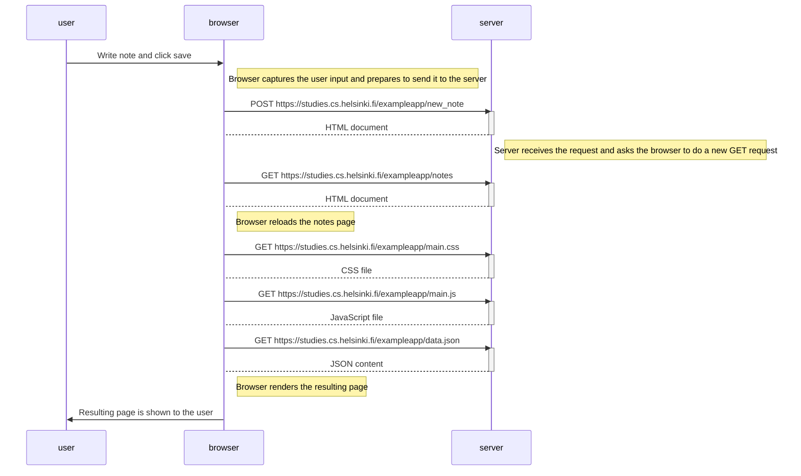

```mermaid

sequenceDiagram
    participant user
    participant browser
    participant server

    user->>browser: Write note and click save
    Note right of browser: Browser captures the user input and prepares to send it to the server

    browser->>server: POST https://studies.cs.helsinki.fi/exampleapp/new_note
    activate server
    server-->browser: HTML document
    deactivate server
    Note right of server: Server receives the request and asks the browser to do a new GET request

    browser->>server: GET https://studies.cs.helsinki.fi/exampleapp/notes
    activate server
    server-->browser: HTML document
    deactivate server
    Note right of browser: Browser reloads the notes page 

    browser->>server: GET https://studies.cs.helsinki.fi/exampleapp/main.css
    activate server
    server-->browser: CSS file
    deactivate server

    browser->>server: GET https://studies.cs.helsinki.fi/exampleapp/main.js
    activate server
    server-->browser: JavaScript file
    deactivate server

    browser->>server: GET https://studies.cs.helsinki.fi/exampleapp/data.json
    activate server
    server-->browser: JSON content
    deactivate server
    Note right of browser: Browser renders the resulting page

    browser->>user: Resulting page is shown to the user

```
