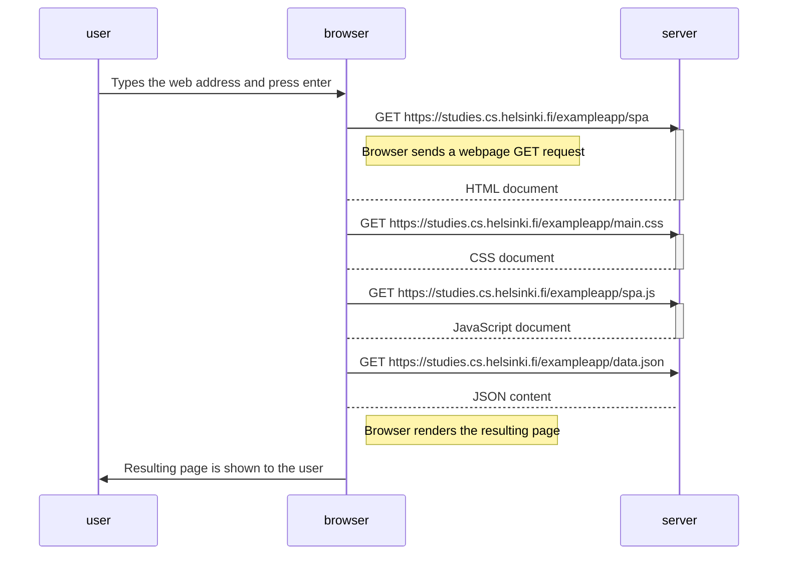

```mermaid

sequenceDiagram
    participant user
    participant browser
    participant server

    user->>browser: Types the web address and press enter

    browser->>server: GET https://studies.cs.helsinki.fi/exampleapp/spa
    activate server
    Note right of browser: Browser sends a webpage GET request

    server-->browser: HTML document
    deactivate server

    browser->>server: GET https://studies.cs.helsinki.fi/exampleapp/main.css
    activate server

    server-->browser: CSS document
    deactivate server

    browser->>server: GET https://studies.cs.helsinki.fi/exampleapp/spa.js
    activate server

    server-->browser: JavaScript document
    deactivate server

    browser->>server: GET https://studies.cs.helsinki.fi/exampleapp/data.json
    activate server
    server-->browser: JSON content
    Note right of browser: Browser renders the resulting page

    browser->>user: Resulting page is shown to the user

```