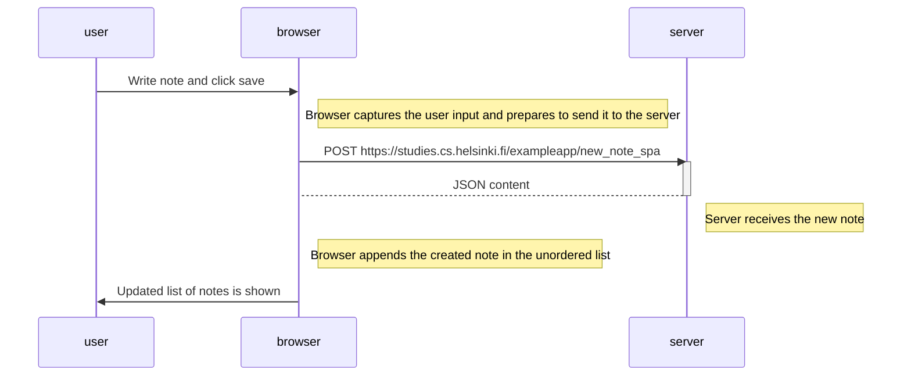

```mermaid

sequenceDiagram
    participant user
    participant browser
    participant server

    user->>browser: Write note and click save
    Note right of browser: Browser captures the user input and prepares to send it to the server

    browser->>server: POST https://studies.cs.helsinki.fi/exampleapp/new_note_spa
    activate server
    server-->browser: JSON content
    deactivate server
    Note right of server: Server receives the new note 
    Note right of browser: Browser appends the created note in the unordered list

    browser->>user: Updated list of notes is shown
```